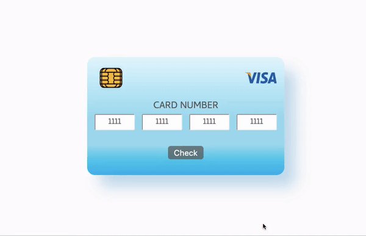

# Luhn algorithm - credit card validity checker

[Demo ▶️](https://yaninatrekhleb.github.io/luhn-algorithm/index.html)

## What is the Luhn Algorithm

A [Luhn algorithm](https://www.investopedia.com/terms/l/luhn-algorithm.asp) is an algorithm used to validate a credit card number or other identifying numbers, such as Social Security numbers. 
The Luhn algorithm, also called the Luhn formula or modulus 10, checks the sum of the digits in the card number and indicates whether the sums equal what is expected or if there is an error in the number sequence. After working through the algorithm, if the total modulus 10 equals zero, then the number is valid according to the Luhn method.

[See detailed explanation on YouTube](https://www.youtube.com/watch?v=wsphC8V36i0)